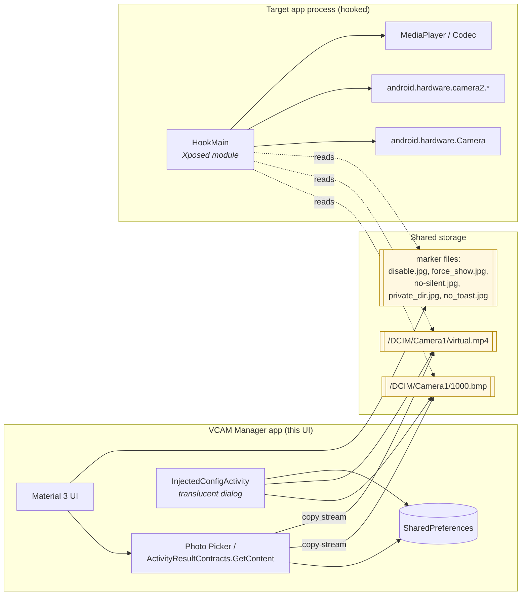
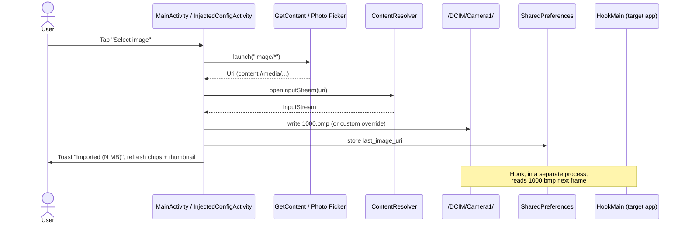
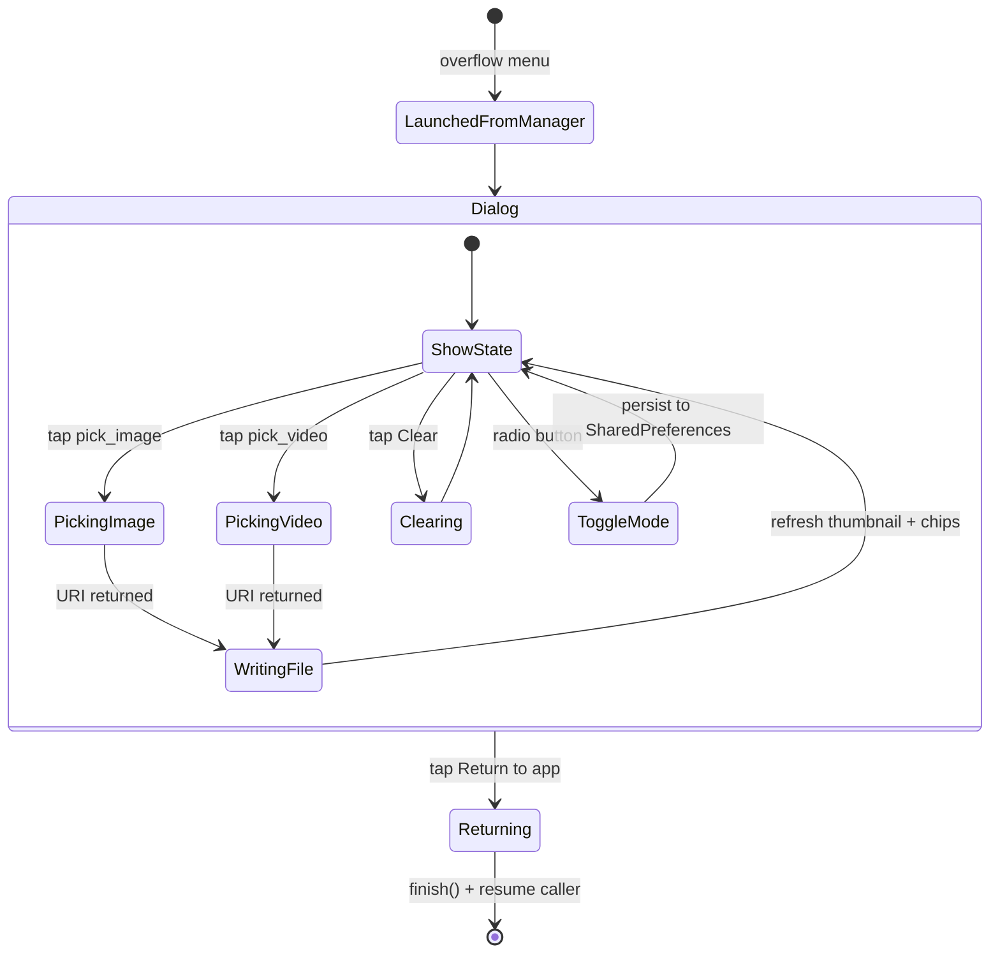

# android_virtual_cam

[English](./README.md) | [简体中文](./README_zh.md) | [繁體中文](./README_tc.md)

> *"The essence of the independent mind lies not in what it thinks, but in how it thinks."* — Christopher Hitchens

A virtual camera for Android, implemented as an Xposed/LSPosed module. It intercepts the camera pipeline of a target application and feeds it a still image or a video of your choosing in place of the live sensor frames. Nothing more, nothing less, and — let this be plain from the outset — nothing to be dressed up in euphemism.

---

## 0. A word before the manual

Software like this attracts two kinds of user. The first is a tinkerer: the developer testing a camera-facing flow without a camera, the QA engineer reproducing a bug on a buildserver, the researcher examining a closed-source app's frame-handling code. That is honest work.

The second kind wishes to deceive another human being — a friend, a counterparty, an institution, a court. The documentation is going to be of no comfort to you. Bluntly: **if your objective requires lying to someone who has not consented to be lied to, this module is not a tool, it is an accomplice, and the law in most jurisdictions has a view on accomplices.** You assume full civil and criminal responsibility for what you do with it. The authors do not.

With that understood, let us proceed.

---

## 1. What, concretely, this thing does

VCAM is a classical Xposed module. On a device with a viable framework (Lsposed, EdXposed, or the creaking original Xposed), when the framework loads a target process, our hooks install themselves into:

- `android.hardware.Camera` — the legacy Camera1 API, including `setPreviewTexture`, `setPreviewDisplay`, `setPreviewCallback`, `takePicture`, and the surrounding state machine.
- `android.hardware.camera2.*` — `CameraDevice`, `CaptureRequest`, `CameraCaptureSession`, and the surface plumbing by which Camera2 apps publish frames.
- `MediaPlayer`/codec surfaces used to decode our replacement video.

The hooks redirect reads from the sensor to a staged file on disk. Two files do all the meaningful work:

| Purpose | Path (default) | Notes |
|---|---|---|
| Replacement **video** for preview | `/[internal-storage]/DCIM/Camera1/virtual.mp4` | Must match the preview resolution the target app requests (it toasts this on first open). |
| Replacement **still image** for capture | `/[internal-storage]/DCIM/Camera1/1000.bmp` | Extension is nominal; any BitmapFactory-decodable image renamed to `.bmp` works. |

A small set of empty marker files beside them toggle behaviour: `disable.jpg`, `force_show.jpg`, `no-silent.jpg`, `private_dir.jpg`, `no_toast.jpg`. These are *flag files* — the hook's runtime reads their existence, not their contents. The v4.5 UI writes and deletes them for you; nostalgic users may continue to `touch` them by hand, and nothing will stop them.

### Architecture, drawn rather than waffled



Observe what is *not* here: no daemon, no content provider, no IPC contract you have to reason about. The hook and the UI communicate through the filesystem, which is primitive, robust, and — since the hook existed before the UI did — deliberately left alone by Phase 2. The UI is a convenience atop an unaltered contract.

---

## 2. Supported platforms

- **Android 5.0 (Lollipop, API 21) and above.** The hook itself goes further back in theory; the Material 3 UI does not, and there is no reasonable case for supporting KitKat in 2025.
- **An Xposed-family framework.** LSPosed on a Magisk/KernelSU root is the contemporary default. Taichi, EdXposed, and original Xposed have all worked in living memory, but they are not what we test against.

---

## 3. What Phase 2 changed

Phase 1 (issue #1) moved the project onto an English-default string catalogue with Chinese mirrors. Phase 2 (this release, `4.5`) is a companion-app overhaul. The hook is untouched.

- **Material 3 UI** (`Theme.Material3.DayNight`), dynamic color on Android 12+, `MaterialToolbar` + `CoordinatorLayout` + `MaterialCardView` sections for *Status*, *Source media*, and *Advanced*. `MaterialButton` and `MaterialSwitch` throughout. Light/dark follow the system.
- **Image/video picker** using `ActivityResultContracts.GetContent` — which, on Android 13+, transparently delegates to the system Photo Picker. No `READ_EXTERNAL_STORAGE` broadside is required on modern Android. The selected URI is streamed into the hook's expected target file; the last-chosen URI is persisted in `SharedPreferences`.
- **Thumbnail preview** rendered from `BitmapFactory` (image) or `MediaMetadataRetriever.getFrameAtTime()` (video first-frame). Bounded sample-size decoding so we don't OOM on a 48-megapixel input.
- **Status chips**: *Module enabled* (best-effort detection of a live Xposed bridge), *Image/Video loaded*, resolution, file size.
- **Advanced**: loop video, mute audio, package filter, and — for the user whose device puts media somewhere impolite — explicit override fields for the image and video target paths. Paths are validated against trivial traversal and null-byte abuse before being persisted.
- **Test camera** opens the system camera via `MediaStore.ACTION_IMAGE_CAPTURE`, so you can check the hook in the amount of time it takes to press one button.
- **First-launch onboarding**: a three-page `ViewPager2` pager explaining enable → select → test. Skippable, and deliberately short; nobody ever wanted *more* onboarding.
- **Injected in-app UI** (the interesting one): `InjectedConfigActivity`, a `Theme.VCAM.Translucent` activity opened from the manager overflow menu so you can re-pick, swap, or clear media without leaving the companion app. Picker failures in constrained contexts are caught and surfaced rather than crashing the process.
- **Accessibility**: `contentDescription` on preview imagery, 48dp minimum tap targets, text contrast checked against the Material palette.
- **i18n**: every new string exists in `values/`, `values-zh/`, `values-zh-rTW/`, with mirrors for `values-zh-rCN/`, `values-zh-rSG/`, `values-zh-rHK/`, `values-zh-rMO/`.

### Picker data flow



### Injected-context UI lifecycle



---

## 4. Installation

The easiest route, for most people, is to install the debug APK attached to the PR that introduced this release and enable the module in LSPosed. The manual route — build it yourself:

```bash
git clone https://github.com/Steake/com.example.vcam.git
cd com.example.vcam
./gradlew :app:assembleDebug
# APK: app/build/outputs/apk/debug/app-debug.apk
```

Requirements: JDK 17, Android SDK with platform 34 and build-tools 30.0.3 (the Gradle download-and-install step will handle the latter). AGP 8.0.2, Gradle 8.0, `androidx` on.

Then in LSPosed: **Modules → VCAM → enable → pick scope (the target apps, not "System Framework")** and force-stop the target. That is the whole ritual.

---

## 5. Using the companion app

1. **Install and enable the module in LSPosed.** Scope: your target apps.
2. **Open VCAM.** On first launch you get the onboarding pager; skip or read.
3. **Select image / Select video.** The file is copied into `/DCIM/Camera1/1000.bmp` / `/DCIM/Camera1/virtual.mp4` (or your custom overrides), the chips update, and the thumbnail appears.
4. **(Optional) Advanced card.** Set a package filter, loop/mute, or a custom path if your device idiosyncratically guards `/DCIM/`.
5. **Test camera** opens the system camera. A successful hook replaces preview and capture with your media.
6. **Inside the target app**, open `InjectedConfigActivity` from the manager's overflow menu to swap media without leaving the companion UI.

### Legacy manual paths (for users who prefer the filesystem)

Nothing about Phase 2 removes what was there. The hook still honours:

- `virtual.mp4`, `1000.bmp` — the media.
- `disable.jpg` — temporarily bypass the module. (Global, real-time.)
- `force_show.jpg` — force the redirect toast every launch. (Global.)
- `no-silent.jpg` — let injected video play its audio.
- `private_dir.jpg` — force per-app private storage as the media source.
- `no_toast.jpg` — suppress toasts.

Create or delete these under `/[internal-storage]/DCIM/Camera1/` by whatever means you prefer. The UI is a convenience, not a gatekeeper.

---

## 6. FAQ, with the usual complaints

**Q1. Front camera looks sideways / mirrored.**
A. In most cases the front-camera replacement needs a horizontal flip and a 90° right rotation, and the *post-transform* resolution must match the toast. Some devices and some apps do not, so judge the device, not the documentation.

**Q2. Black screen / camera fails to open.**
A. Either the app is one of the few that resists hooking (system camera, in particular), or you have nested `Camera1/Camera1/` and the hook cannot find the file. One `Camera1` directory. One.

**Q3. Blurry or scrambled preview.**
A. Wrong resolution. Read the toast.

**Q4. Stretched image.**
A. Re-encode the media to the target resolution. No runtime stretcher ships with this module.

**Q5. `disable.jpg` does nothing.**
A. On app versions `<= 4.0`, marker files in `/DCIM/Camera1/` only affect apps that *have* storage permission; for the rest, create markers in the app's private directory. On versions `>= 4.1`, `/DCIM/Camera1/` is read regardless.

---

## 7. Reporting bugs

Open an issue. If it is a bug, attach the **Xposed module log** (LSPosed → Logs → Module). Screenshots of the UI are welcome; guesses are less so.

---

## 8. Credits

- Hook design: [wangwei1237/CameraHook](https://github.com/wangwei1237/CameraHook)
- H.264 hardware decode: [zhantong/Android-VideoToImages](https://github.com/zhantong/Android-VideoToImages)
- JPEG→YUV conversion reference: [jacke121 / CSDN](https://blog.csdn.net/jacke121/article/details/73888732)
