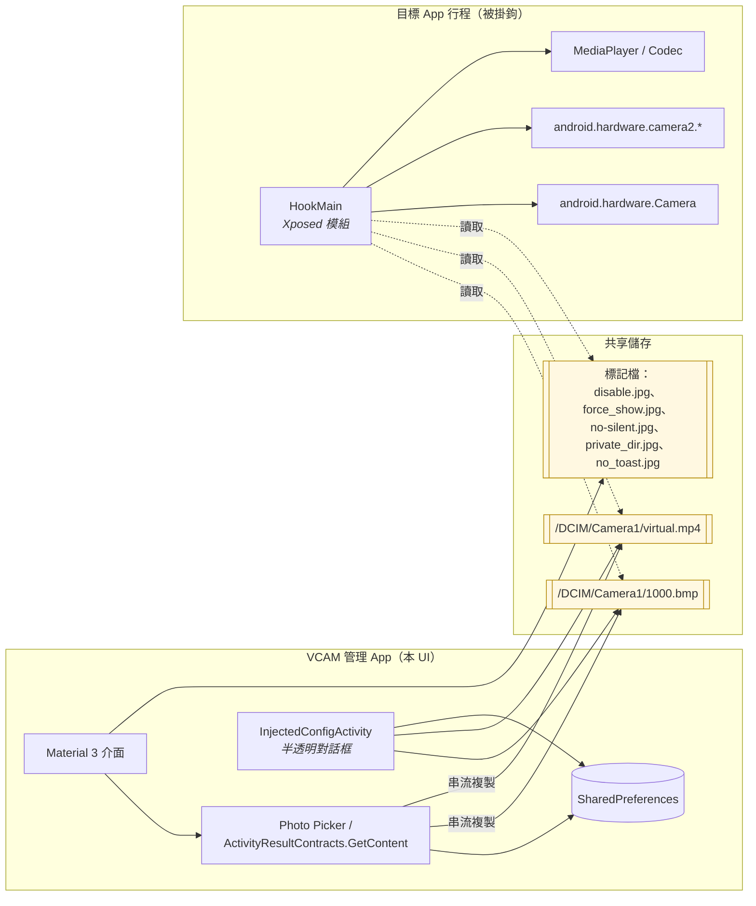
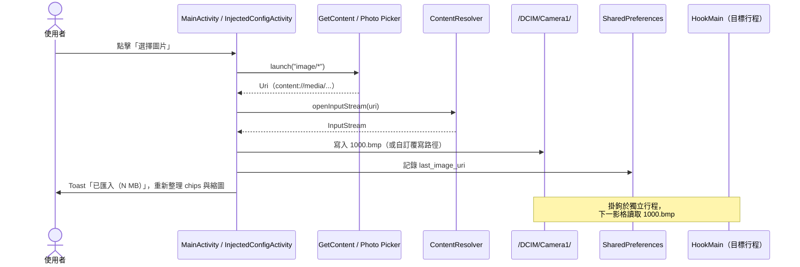
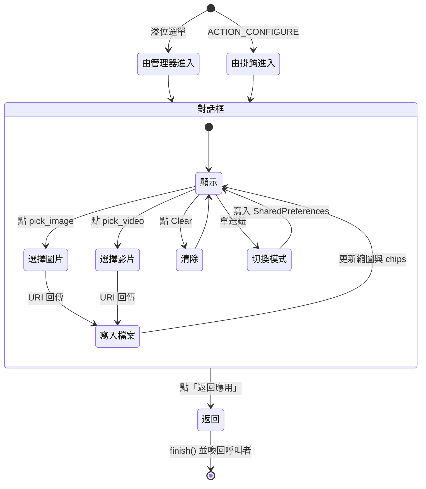

# android_virtual_cam

[简体中文](./README.md) | [繁體中文](./README_tc.md) | [English](./README_en.md)

> *「獨立心智的本質，不在於它想什麼，而在於它怎樣去想。」* —— 克里斯多福·希鈞斯

一款基於 Xposed/LSPosed 的 Android 虛擬攝影機模組。它將目標應用程式相機管線中的即時感測器影格，替換為你提供的一張圖片或一段影片。僅此而已——也先把話說在前頭：此處不用任何委婉語。

---

## 0. 進入說明之前

這類軟體會吸引兩類使用者。一類是愛折騰的人：在沒有實體相機的 CI 上除錯相機流程的開發者、研究閉源 App 影格處理的安全研究者、為了重現 bug 把裝置束諸高閣的 QA。這些都是正經工作。

另一類希望用它去欺騙一個並未同意被欺騙的人——朋友、交易對手、機構、法院。這份文件對你毫無用處。直白地說：**如果你的目的需要向一個未同意被騙的人撒謊，這個模組就不是工具，而是共犯；大多數法域對「共犯」二字有明確立場。** 使用者自行承擔一切民事與刑事責任，作者概不負責。

明白了這一點，我們繼續。

---

## 1. 它究竟在做什麼

VCAM 是一個典型的 Xposed 模組。在具備可用框架（LSPosed、EdXposed，或那具老古董 Xposed Original）的裝置上，框架把目標行程拉起來時，本模組掛入以下位置：

- `android.hardware.Camera` —— 傳統 Camera1：`setPreviewTexture`、`setPreviewDisplay`、`setPreviewCallback`、`takePicture` 與相關狀態機。
- `android.hardware.camera2.*` —— `CameraDevice`、`CaptureRequest`、`CameraCaptureSession` 與供圖的 surface 管線。
- `MediaPlayer`/編解碼器的 surface，用以解碼我們的替換影片。

掛鉤把從感測器讀取的內容，改為從磁碟上預先暫存的檔案讀取。實際幹活的只有兩個檔案：

| 用途 | 預設路徑 | 說明 |
|---|---|---|
| 預覽用**影片** | `/[內部儲存]/DCIM/Camera1/virtual.mp4` | 解析度需符合目標 App 首次開啟時 Toast 顯示的數值。 |
| 拍照用**靜態圖片** | `/[內部儲存]/DCIM/Camera1/1000.bmp` | 副檔名僅為約定，任何 BitmapFactory 可解碼的圖片改名 `.bmp` 皆可。 |

旁邊還有若干「標記檔」開關：`disable.jpg`、`force_show.jpg`、`no-silent.jpg`、`private_dir.jpg`、`no_toast.jpg`。掛鉤只關心它們**是否存在**，並不讀內容。4.5 版的 UI 會替你建立／刪除；懷舊派繼續用 `touch` 完全合法。

### 與其囉嗦，不如作圖



注意這裡**沒有**的東西：沒有常駐行程、沒有 ContentProvider、沒有要你理解的 IPC 契約。掛鉤與 UI 完全透過檔案系統通訊——原始、穩健，並且由於掛鉤早於 UI 存在，第二階段刻意保留了這份契約不動。UI 只是舊契約外的一層便利。

---

## 2. 支援平臺

- **Android 5.0（API 21）以上。** 掛鉤理論上可以更早；但 Material 3 UI 不行，也沒有理由為 2025 年的 KitKat 操心。
- **Xposed 系框架。** 目前最常見的組合是 Magisk/KernelSU + LSPosed。Taichi、EdXposed、Xposed 原版都能用過，但非我們測試目標。

---

## 3. 第二階段改了什麼

第一階段（issue #1）將專案遷為英文預設、中文鏡像的字串目錄。第二階段（本次 `4.5` 發布）是配套 App 的全面整修。掛鉤本身未動。

- **Material 3 UI**：`Theme.Material3.DayNight`；Android 12+ 啟用動態取色；`MaterialToolbar + CoordinatorLayout + MaterialCardView` 把介面分為「狀態」「來源媒體」「進階」三張卡；全面採用 `MaterialButton` / `MaterialSwitch`；淺色／深色跟隨系統。
- **圖片／影片選取器**：以 `ActivityResultContracts.GetContent` 為基礎，Android 13+ 會自動走系統 Photo Picker。現代 Android 上不再粗暴索取 `READ_EXTERNAL_STORAGE`。所選 URI 以串流方式寫入掛鉤期望的目標檔；上次選擇的 URI 寫入 `SharedPreferences`。
- **縮圖預覽**：圖片用 `BitmapFactory`，影片用 `MediaMetadataRetriever.getFrameAtTime()`。使用 `inSampleSize`，即便 48MP 原檔也不會把進程撐爆。
- **狀態 Chips**：*模組已啟用*（盡力偵測 Xposed bridge）、*圖片／影片已載入*、解析度、檔案大小。
- **進階**：循環影片、影片靜音、套件名稱過濾；針對對 `/DCIM/` 有特殊限制的裝置，提供自訂圖片／影片目標路徑——寫入前做了最基本的路徑校驗（拒絕相對 `..` 段、拒絕含空位元組）。
- **測試相機**：透過 `MediaStore.ACTION_IMAGE_CAPTURE` 開啟系統相機，一鍵驗證掛鉤是否生效。
- **首次啟動引導**：`ViewPager2` 三頁——啟用、選素材、測試。可略過。從未有人抱怨引導太短。
- **應用內注入 UI**（最有趣的一塊）：`InjectedConfigActivity`，採 `Theme.VCAM.Translucent`，以 `com.example.vcam.action.CONFIGURE` Intent action 暴露。掛鉤、使用者或捷徑均可喚起；支援重新選擇、切換、清除素材、於「全域／各應用程式」模式間切換，並以「返回應用」收尾。受限上下文中的選取器錯誤會被攔下而不波及目標程序。
- **無障礙**：預覽元件具 `contentDescription`、點擊目標 ≥48dp、文字對比度符合 Material 色盤要求。
- **本地化**：所有新增字串皆涵蓋 `values/`、`values-zh/`、`values-zh-rTW/`，並為 `values-zh-rCN/`、`values-zh-rSG/`、`values-zh-rHK/`、`values-zh-rMO/` 提供鏡像。

### 選取器資料流



### 注入 UI 生命週期



---

## 4. 安裝

最省事的做法是直接安裝發布 PR 附帶的 debug APK，並於 LSPosed 中啟用模組。手動建置亦可：

```bash
git clone https://github.com/Steake/com.example.vcam.git
cd com.example.vcam
./gradlew :app:assembleDebug
# APK：app/build/outputs/apk/debug/app-debug.apk
```

相依：JDK 17、Android SDK（platform 34 + build-tools 30.0.3；Gradle 會自行下載後者）。AGP 8.0.2、Gradle 8.0，已啟用 `androidx`。

其後於 LSPosed：**模組 → VCAM → 啟用 → 勾選作用域（目標 App，非系統框架）**，然後對目標 App 執行「強制停止」。整個儀式就到此為止。

---

## 5. 使用配套 App

1. **於 LSPosed 啟用模組**，作用域勾選目標 App。
2. **開啟 VCAM**。首次啟動會出現引導頁；略過或閱讀皆可。
3. **選擇圖片／選擇影片**：檔案會被拷入 `/DCIM/Camera1/1000.bmp` 與 `/DCIM/Camera1/virtual.mp4`（或自訂覆寫路徑）；chips 更新，縮圖出現。
4. **（可選）進階卡**：設定套件過濾、循環／靜音，或為對 `/DCIM/` 有特殊限制的裝置設定自訂路徑。
5. **「測試相機」**：直接開啟系統相機。掛鉤生效時，預覽與拍照都會被你的素材替換。
6. **在目標 App 中**：透過管理器溢位選單、桌面捷徑或 `am start -a com.example.vcam.action.CONFIGURE` 喚起 `InjectedConfigActivity`，原地切換素材。

### 舊式手動路徑（偏好檔案系統的使用者）

第二階段未刪除任何舊行為。掛鉤仍支援：

- `virtual.mp4`、`1000.bmp` —— 素材本身。
- `disable.jpg` —— 暫時停用模組（全域、即時）。
- `force_show.jpg` —— 每次皆顯示重新導向 Toast（全域）。
- `no-silent.jpg` —— 允許注入影片發聲。
- `private_dir.jpg` —— 強制各 App 使用私有目錄作為素材來源。
- `no_toast.jpg` —— 屏蔽提示 Toast。

於 `/[內部儲存]/DCIM/Camera1/` 下自行 `touch` 或刪除即可。UI 是便利，不是守門人。

---

## 6. 常見問題

**Q1. 前鏡頭方向不對／鏡像。**
A. 多數情況下需水平翻轉 + 右旋 90°；**處理後**的解析度須與 Toast 一致。少數情況無需調整——以裝置為準，不以文件為準。

**Q2. 黑畫面／相機打不開。**
A. 要麼該 App 掛不上（尤其系統相機），要麼你建了雙層 `Camera1/Camera1/`。只需要一層 `Camera1`。就一層。

**Q3. 花屏。**
A. 解析度不對。讀 Toast。

**Q4. 拉伸／變形。**
A. 用剪輯軟體將素材重新編碼到目標解析度。模組未內建執行階段縮放器。

**Q5. `disable.jpg` 無效。**
A. 版本 `<=4.0`：`/DCIM/Camera1/` 下的標記檔**僅對具儲存權限**的 App 生效，其餘無權限的 App 須在各自私有目錄建立。版本 `>=4.1`：統一放 `/DCIM/Camera1/`，無論權限。

---

## 7. 回報問題

直接到 issues 提交。若為 BUG，請附上 **Xposed 模組日誌**（LSPosed → 日誌 → 模組）。歡迎 UI 截圖；猜測就免了。

---

## 8. 致謝

- 掛鉤思路：[wangwei1237/CameraHook](https://github.com/wangwei1237/CameraHook)
- H.264 硬體解碼：[zhantong/Android-VideoToImages](https://github.com/zhantong/Android-VideoToImages)
- JPEG→YUV 轉換參考：[jacke121 / CSDN](https://blog.csdn.net/jacke121/article/details/73888732)
