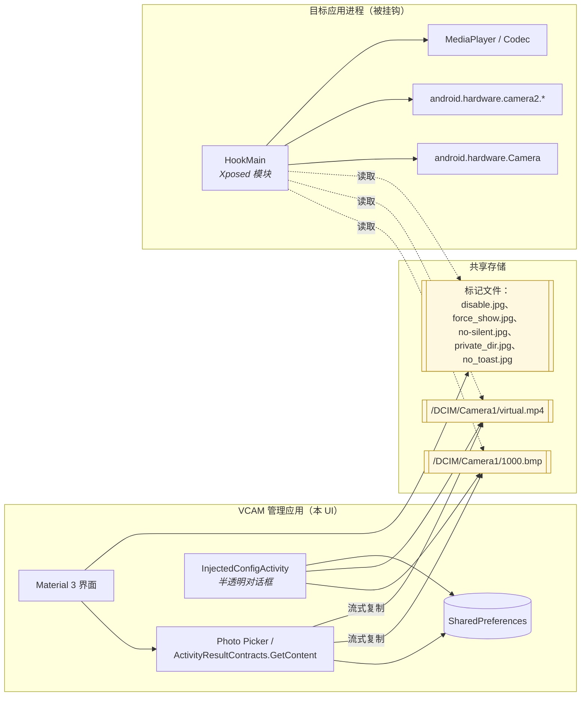
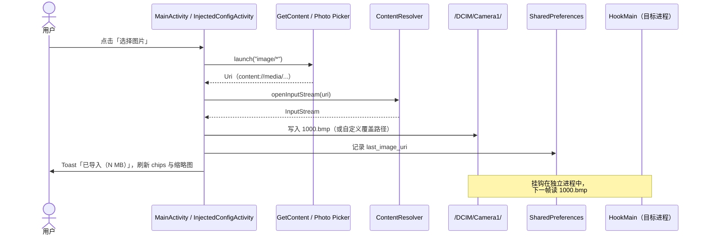
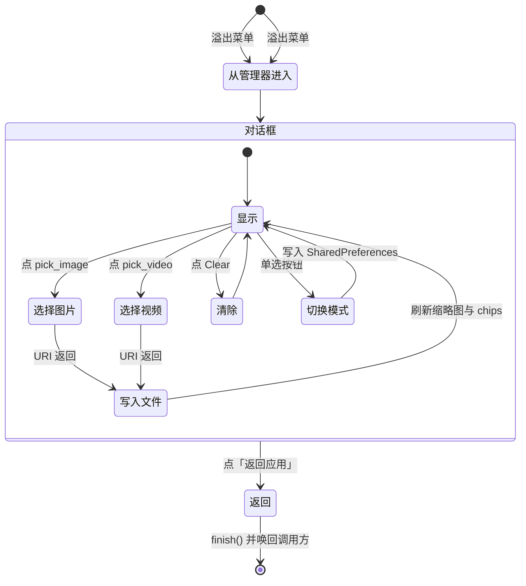

# android_virtual_cam

[English](./README.md) | [简体中文](./README_zh.md) | [繁體中文](./README_tc.md)

> *"独立心智的本质，不在于它想什么，而在于它怎样去想。"* —— 克里斯托弗·希钦斯

一款基于 Xposed/LSPosed 的 Android 虚拟摄像头模块。它把目标应用相机管线里的实时传感器帧，替换成你提供的一张图片或一段视频。仅此而已——也请把话说在前头：这里不用任何委婉语。

---

## 0. 进入手册之前

这种软件会吸引两类用户。一类是折腾者：在没有实体相机的构建服务器上调试相机流程的开发者、研究闭源 App 帧处理的安全工程师、为了复现 bug 把设备扔进柜子里的 QA。这些都是正经事。

另一类希望以此欺骗一个并未同意被欺骗的人——朋友、交易对手、机构、法庭。这份文档对你毫无用处。直白地说：**如果你的目的需要向一个没有同意被骗的人撒谎，这个模块就不是工具，而是共犯；大多数法域对"共犯"这个词是有明确立场的。** 使用者自行承担一切民事与刑事责任，作者概不负责。

此点若已明了，我们继续。

---

## 1. 它到底在做什么

VCAM 是一个典型的 Xposed 模块。在具备可用框架（LSPosed、EdXposed，或那具老古董 Xposed Original）的设备上，当框架把目标进程拉起来时，本模块挂入以下位置：

- `android.hardware.Camera` —— 传统 Camera1：`setPreviewTexture`、`setPreviewDisplay`、`setPreviewCallback`、`takePicture` 以及相关的状态机。
- `android.hardware.camera2.*` —— `CameraDevice`、`CaptureRequest`、`CameraCaptureSession` 与供图的 surface 管线。
- `MediaPlayer`/编解码器的 surface，用来解码我们的替换视频。

挂钩把从传感器读取的内容，改为从磁盘上预先暂存的文件读取。干活的其实只有两个文件：

| 用途 | 默认路径 | 说明 |
|---|---|---|
| 预览用**视频** | `/[内部存储]/DCIM/Camera1/virtual.mp4` | 分辨率需匹配目标 App 首次打开时 Toast 提示的数值。 |
| 拍照用**静态图片** | `/[内部存储]/DCIM/Camera1/1000.bmp` | 扩展名只是约定，任何 BitmapFactory 可解码的图片改名为 `.bmp` 均可。 |

旁边还有若干"标记文件"开关：`disable.jpg`、`force_show.jpg`、`no-silent.jpg`、`private_dir.jpg`、`no_toast.jpg`。挂钩只关心它们**是否存在**，不读内容。4.5 版本的 UI 会替你新建/删除，怀旧派继续用 `touch` 也完全合法。

### 与其废话，不如作图



注意这里**没有**的东西：没有守护进程、没有 ContentProvider、没有要你搞懂的 IPC 契约。挂钩与 UI 全靠文件系统通信——原始、稳健，而且由于挂钩比 UI 先存在，第二阶段特意保留了这份契约不动。UI 只是披在旧契约外面的一层便利。

---

## 2. 平台支持

- **Android 5.0（API 21）及以上。** 理论上挂钩可以更往回走；但 Material 3 的 UI 不行，也没有理由在 2025 年为 KitKat 操心。
- **Xposed 系框架。** 当下就是 Magisk/KernelSU + LSPosed。Taichi、EdXposed 以及 Xposed 原版都曾经工作过，但不是我们的测试目标。

---

## 3. 第二阶段改了什么

第一阶段（issue #1）把项目迁到英语为默认、中文为镜像的字符串目录。第二阶段（本次 `4.5` 发布）是对配套 App 的全面翻新。挂钩本身未动。

- **Material 3 UI**：`Theme.Material3.DayNight`，Android 12+ 开启动态取色，`MaterialToolbar + CoordinatorLayout + MaterialCardView` 把界面划为「状态」「素材媒体」「高级」三张卡；全面替换为 `MaterialButton` / `MaterialSwitch`；浅色/深色跟随系统。
- **图片/视频选择器**：基于 `ActivityResultContracts.GetContent`，Android 13+ 自动走系统 Photo Picker。现代 Android 上不再一刀切地索取 `READ_EXTERNAL_STORAGE`。选中的 URI 通过流拷贝写入挂钩期望的目标文件；上一次选择的 URI 持久化到 `SharedPreferences`。
- **缩略图预览**：图片走 `BitmapFactory`，视频走 `MediaMetadataRetriever.getFrameAtTime()`。解码走 `inSampleSize`，48MP 的图也不会把进程撑爆。
- **状态 Chips**：*模块已启用*（尽力检测 Xposed bridge）、*图片/视频已加载*、分辨率、文件大小。
- **高级**：循环视频、视频静音、包名过滤；对于 `/DCIM/` 被特殊厂商守护的设备，还提供图片与视频的自定义目标路径输入——写入前做了最基本的路径校验（拒绝相对 `..` 段、拒绝包含空字节）。
- **测试相机**：通过 `MediaStore.ACTION_IMAGE_CAPTURE` 打开系统相机，一秒内验证挂钩是否生效。
- **首次启动引导**：`ViewPager2` 三页——启用、选素材、测试。可跳过。没人想要更长的引导。
- **应用内注入 UI**（这是有意思的那块）：`InjectedConfigActivity`，使用 `Theme.VCAM.Translucent`，作为 `Theme.VCAM.Translucent` 的半透明界面，由管理器溢出菜单打开；支持再选、切换与清除素材，并以「返回应用」收尾。受限上下文里的选择器异常不会把目标进程带走。
- **无障碍**：预览控件具 `contentDescription`，点击目标 ≥48dp，文字对比度符合 Material 色板的要求。
- **本地化**：所有新增字串都覆盖 `values/`、`values-zh/`、`values-zh-rTW/`，并为 `values-zh-rCN/`、`values-zh-rSG/`、`values-zh-rHK/`、`values-zh-rMO/` 提供镜像。

### 选择器数据流



### 注入 UI 生命周期



---

## 4. 安装

最省事的办法是直接装发布 PR 里附带的 debug APK，然后在 LSPosed 里启用。自行构建也可以：

```bash
git clone https://github.com/Steake/com.example.vcam.git
cd com.example.vcam
./gradlew :app:assembleDebug
# APK：app/build/outputs/apk/debug/app-debug.apk
```

依赖：JDK 17、Android SDK（platform 34 + build-tools 30.0.3，Gradle 会自行下载后者）。AGP 8.0.2、Gradle 8.0，已启用 `androidx`。

然后在 LSPosed：**模块 → VCAM → 启用 → 勾选作用域（目标 App，非系统框架）**，最后对目标 App 执行「强制停止」。全部仪式就是这样。

### 中国大陆加速地址（Gitee 平台）

<https://gitee.com/w2016561536/android_virtual_cam>

---

## 5. 使用配套 App

1. **在 LSPosed 中启用模块**，作用域选目标 App。
2. **打开 VCAM**。首次启动会看到引导页，跳过或阅读皆可。
3. **选择图片/选择视频**：文件会被拷入 `/DCIM/Camera1/1000.bmp` 与 `/DCIM/Camera1/virtual.mp4`（或你填的自定义路径）；chips 会更新，缩略图会出现。
4. **（可选）高级卡**：设包名过滤、循环/静音，或在设备对 `/DCIM/` 有特殊限制时设定自定义路径。
5. **「测试相机」**：直接打开系统相机。挂钩生效时，预览与拍照都会被你的素材替换。
6. **在目标 App 内**：可通过管理器的溢出菜单打开 `InjectedConfigActivity`，就地切换素材。

### 旧式手动路径（偏爱文件系统的用户）

第二阶段没删除任何旧行为。挂钩依然识别：

- `virtual.mp4`、`1000.bmp` —— 素材本身。
- `disable.jpg` —— 临时停用模块（全局、实时）。
- `force_show.jpg` —— 每次都显示重定向 Toast（全局）。
- `no-silent.jpg` —— 允许注入视频发声。
- `private_dir.jpg` —— 强制每个 App 使用私有目录作为素材源。
- `no_toast.jpg` —— 屏蔽提示 Toast。

在 `/[内部存储]/DCIM/Camera1/` 自行 `touch` 或删除皆可。UI 是便利，不是守门人。

---

## 6. 常见问题

**Q1. 前置摄像头方向不对/镜像了。**
A. 多数情况下需要水平翻转 + 右旋 90°；**处理后**的分辨率需与 Toast 一致。少数情况无需调整——以设备为准，不以文档为准。

**Q2. 黑屏 / 无法打开相机。**
A. 要么这个 App 挂不上（特别是系统相机），要么你建了双层 `Camera1/Camera1/`。只需要一层 `Camera1`。就一层。

**Q3. 花屏。**
A. 分辨率不对。读 Toast。

**Q4. 拉伸/变形。**
A. 用剪辑软件把素材重新编码到目标分辨率。模块内不内置运行时缩放器。

**Q5. `disable.jpg` 无效。**
A. App 版本 `<=4.0`：`/DCIM/Camera1/` 下的标记文件**只对有存储权限**的 App 生效，其余无权限的 App 要放进各自的私有目录。版本 `>=4.1`：统一放 `/DCIM/Camera1/`，无论权限。

---

## 7. 反馈问题

直接到 issues 里提。若是 BUG，请附 **Xposed 模块日志**（LSPosed → 日志 → 模块）。欢迎 UI 截图；猜测就算了。

---

## 8. 致谢

- 挂钩思路：[wangwei1237/CameraHook](https://github.com/wangwei1237/CameraHook)
- H.264 硬解码：[zhantong/Android-VideoToImages](https://github.com/zhantong/Android-VideoToImages)
- JPEG→YUV 转换参考：[jacke121 / CSDN](https://blog.csdn.net/jacke121/article/details/73888732)
